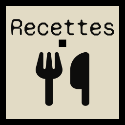
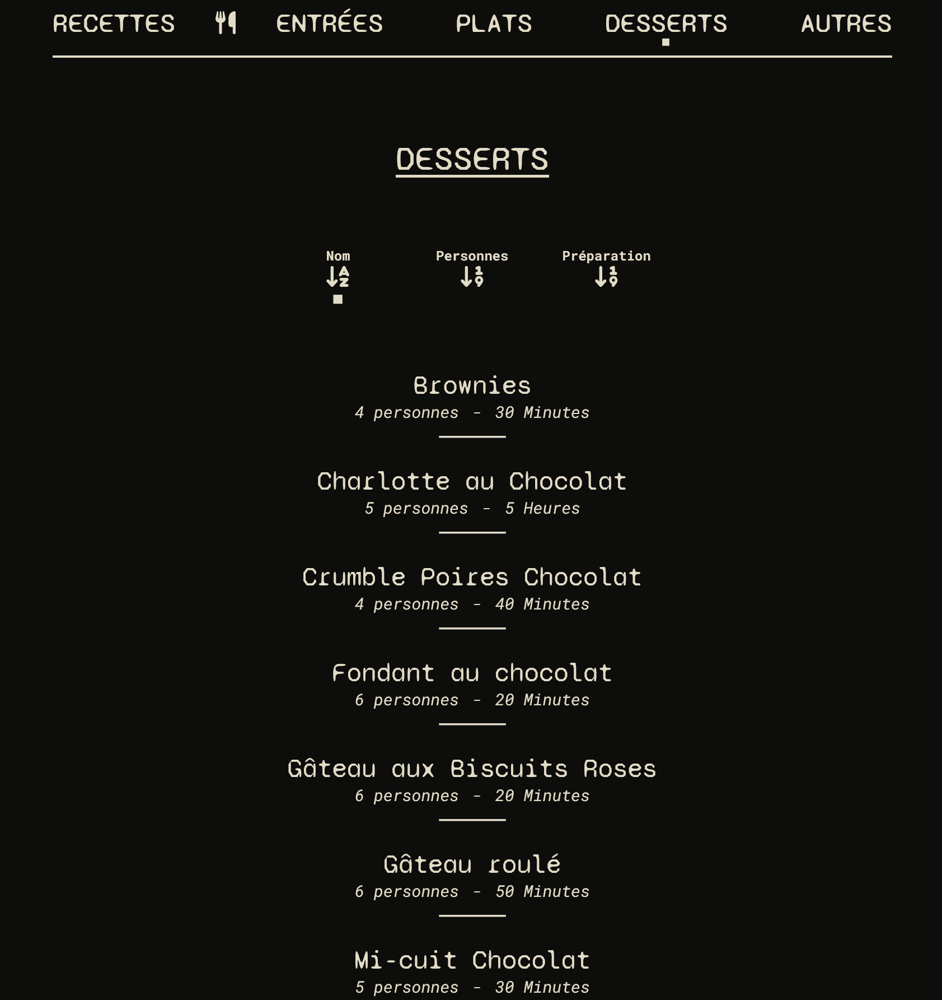
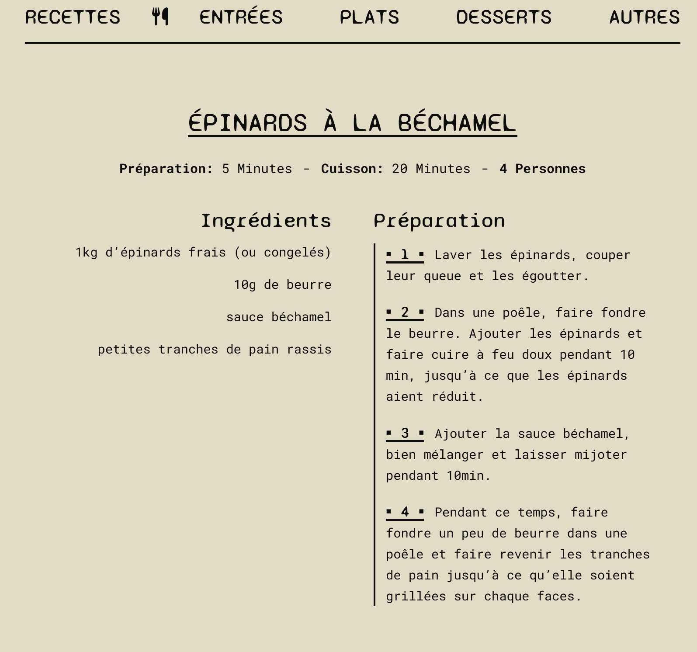

<h1 align="center">
 

 
Recettes
 
</h1>

<h4 align="center">Site de recettes de cuisine, développé avec React/Vite, Node/Express et MongoDB.</h4>

---

  <a href="https://recettes-cuisine.vercel.app">Visiter le site</a>

---

---

## Screenshots

 
 

---

  <a href="https://github.com/choupal">
    Choupal
  </a>

   
   

  

   

---